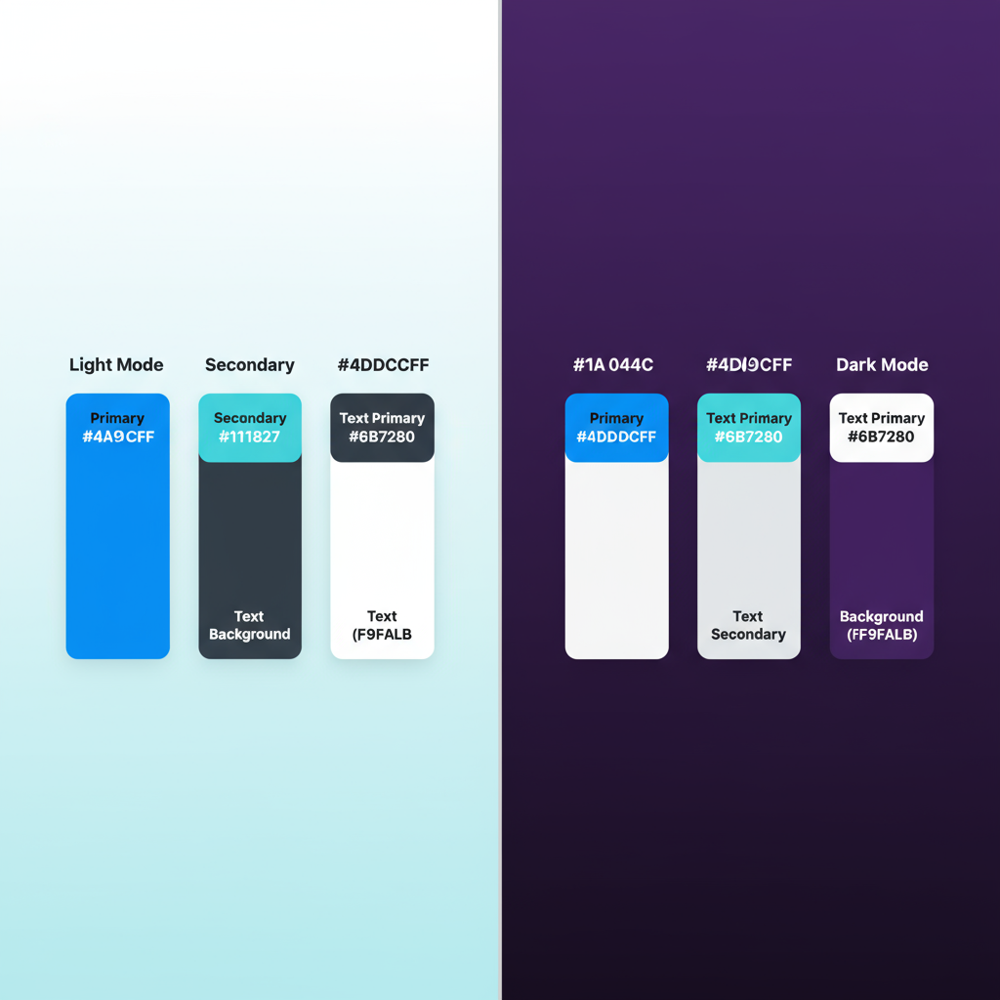

# Whaling Brand Book

A clean, aquatic identity built around bright blues and soft gradients, inspired by the calm and power of the ocean.

## Panorama

## Logos

### Primary Logos
| Light Theme | Dark Theme | Monochrome |
|-------------|------------|------------|
|  |  |  |

### Square Variants
| Light Theme | Dark Theme |
|-------------|------------|
|  |  |

### Default Logo

## Color Palette

### Primary Colors
- **Primary**: `#4A9CFF` (Bright Ocean Blue)
- **Secondary**: `#4DDCFF` (Aqua Cyan)

### Text Colors
- **Dark Text**: `#111827`
- **Light Text**: `#F9FAFB`
- **Secondary Text**: `#6B7280`

### Backgrounds
- **Light Background**: `#F9FAFB`
- **Dark Gradient**: `#1A044C → #0F0133`

---

For detailed implementation guidelines, colors, and components, see the [brand guide PDF](guidelines/brand_guide.pdf).
